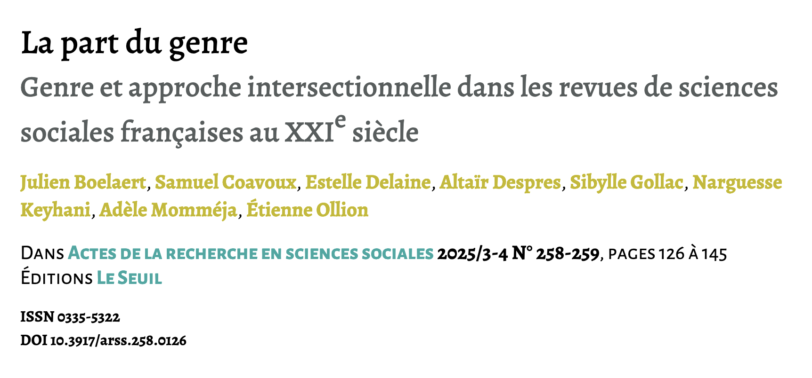

## Présentation & démo

- Pourquoi ActiveTigger ? 
    - CSS & NLP
    - Principales fonctionnalités d'ActiveTigger
- Démo
- Discussion
    - Usages spécifiques
    - Evolution de nos pratiques

## Origines d'ActiveTigger

- Des usages de recherche stabilisés
    - Annoter des grands corpus avec un ensemble de labels
- Démocratiser l'accès au-delà du code
    - Démonstrateur en R (É. Ollion et J.Boelaert en 2023)
    - Mettre à l'échelle et constituer une communauté de pratique
- Faciliter les interactions humaines
    - Besoin de collaborer sur un projet
    - Faciliter la formation aux outils

## Impacts de recherche

Groupe [CSS@IPP](https://www.css.cnrs.fr/) au CREST

- [Le prix de la visibilité. Une analyse computationnelle des interactions en ligne avec des député·es français·es. Revue française de science politique, Claesson A., 2025](https://shs.cairn.info/revue-revue-francaise-de-science-politique-2025-3-page-IX)
-  [La part du genre. Genre et approche intersectionnelle dans les sciences sociales françaises au XXIe siècle, Boelaert J. et al, 2025.](https://shs.cairn.info/revue-actes-de-la-recherche-en-sciences-sociales-2025-3-4-page-126?lang=fr)

Communauté plus large en formation

- Identifier les articles de presse qui parlent de l'environnement (Jules Brion)
- Traitement de corpus d'image (Adrien Rougier et Francesco Colonna)
- ...

## Des valeurs structurantes

- Augmenter l'humain de manière contrôlée, pas le remplacer
- Favoriser l'exploration, l'idéation et les échanges
- Maitriser le code & les composants utilisés (code auditable)
- Évolutif en fonction des besoins de recherche
    - Nouvelles collaborations autour des instruments

## Des contributions multiples

- Comité Scientifique
- Accompagnement par Ouestware (Paul Girard)
- Beaucoup de retours des utilisateurs : Merci !
    - Nouvelles features
    - Intégration continue

## Situation actuelle

Une V1 en pré-release et une communauté d'utilisateurs instance dev. du CREST

- [Page sur le groupe CSS](css.cnrs.fr/active-tigger)
- [Dépot Github du code](github.com/activetigger/activetigger)
- [Documentation](activetigger.com/documentation)
- [Serveur Discord](https://discord.gg/sd2Em7rrW2)

Pour avoir un compte sur l'instance du CREST : css@ensae.fr

## Pourquoi ActiveTigger ?

*Tout peut être fait avec un tableur et du code*

- Faciliter l'interaction avec les données
- Travail en collaboration
- Contraindre les étapes pour garantir la progression
- Avoir de l'active learning pour annoter plus vite
- Accès à des ressources GPU en fonction de l'instance
- Traitement en volume (encodeurs assez légers)

## Concrètement ? D'abord une question

**Comment évolue la prise en compte des réflexion sur le genre dans la littérature en sciences sociales françaises ?** 

{fig-align="center"}

Données: Abstract des articles de sciences sociales publiés dans des revues françaises entre 2000 et 2022.

## Logique générale

**TL;DR : Mettre un label "genre"/"pas genre" sur un gros volume d'abstracts**

- Définir les concepts
- Annoter un corpus d'entrainement
    - Maximiser la diversité et limiter le temps passé
- Entrainer un classifieur pour prédire
    - Améliorer à un seuil acceptable
- L'appliquer à l'ensemble du corpus
- Télécharger les résultats
- Analyser...

## Étapes principales

{fig-align="center"}

## D'autres fonctionnalités

- Explorer avec Bertopic
- Sélectionner avec la projection
- Utiliser les prédictions des BERT pour l'active learning
- Comparer les annotations entre utilisateurs
- Expérimenter avec le génératif

## Au commencement : des données

Tout un travail en amont : mettre en forme les données dans un tableau (pas dans ActiveTigger)

- ~30,000 articles, découpées au niveau de la phrase = 50,000 lignes
- Métadonnées présentes: revue, discipline et la proportion d'hommes/femmes dans les co-auteur.ices
- Une colonne d'annotations utilisées comme "gold-standard"

## Étape centrale : le codage

Travail conceptuel : différentes conception du genre

- Quelles sont les catégories ?
- Expérimenter
    
*Choix d'une conception large : à la fois rapports de genre, mention des aspects genrés dans les processus sociaux, etc.*

Une étape qui n'en est pas une : stabilisation progressive

## Passage à la démo

- Projet déjà créé
- Comptes accessibles ici sur une instance démo : [https://hedgedoc.lab.groupe-genes.fr/XuEZOCBfS-qH1OS88aq9hA](https://hedgedoc.lab.groupe-genes.fr/XuEZOCBfS-qH1OS88aq9hA)

# Démo

## Se lancer

- Envoyer un mail pour obtenir un compte
    - Ou créer sa propre instance
- Se lancer dans un projet
- Venir discuter sur le Discord

## La feuille de route ?

- Améliorer l'intégration de l'IA générative
- Finalser le module image & ner
- Une meilleure architecture
    - Gestion de la file d'attente
- Meilleure distribution pour deployer (helm chart)
- ...

## Comment citer ActiveTigger

> Schultz, E., Boelaert, J., Morin, A., Bonutti D'Agostini, E., Claesson, A., Ollion, É., & Chatelain, A. (2026). ActiveTigger: An open source collaborative text annotation software for computational social sciences. In Proceedings of the 18th International Conference on Statistical Analysis of Textual Data (JADT 2026), Palermo, Italy, July 8–10, 2026.

# Annexe : notions

## Embeddings

Embeddings/plongements = représentations vectorielles d'une entité avec un modèle entrainé à conserver l'aspect sémantique.

{fig-align="center"}

Source [Joel Barnard — What is embedding?](https://www.ibm.com/think/topics/embedding) [Manoj Kumar — Explain vector embeddings to your mom](https://peerlist.io/manojsde/articles/explain-vector-embeddings-to-your-mom)

## Apprentissage supervisé

- Données d'entraînement : des exemples annotés par l'humain
- Apprentissage : un modèle (des poids) progressivement modifié pour améliorer la prédiction sur ces données
- Prédiction : à partir d'une nouvelle entrée, prédire la valeur
- Évaluation : vérifier la qualité de la prédiction
    - Différentes métriques suivant la tâche
    - Sur des données initialement non utilisées pour entrainer

## Active Learning

Plutôt que d'annoter au hasard, sélectionner certains éléments

- Départ : entrainer un modèle sur un petit nombre d'annotation
- Identification des éléments les plus incertains
- Prioriser ces éléments
- Réentrainer le modèle & itérer

Pourquoi c'est utile ?

- Moins d'étiquetage : réduire le travail humain
- Datasets de meilleur qualité : limiter la redondance de l'information

## Classifier BERT

Une architecture particulière de modèle préentrainés (transformers) de type encodeurs de taille "raisonnable".

Source: [Jay Alammar — The Illustrated BERT, ELMo, and co. (How NLP Cracked Transfer Learning)](https://jalammar.github.io/illustrated-bert/)

## Quick et BERT modèles

Des types différents de modèles

- Le nombre de poids : quick  =  centaines de paramètres  ; BERT = centaines de millions
- Le pré-entrainement : quick = entrainé juste sur les données ; BERT = pré-entrainés sur de très gros corpus
- Le temps d'entraînement : <2 min pour les quicks et jusqu'à plusieurs dizaines de minutes pour les plus gros modèles BERT