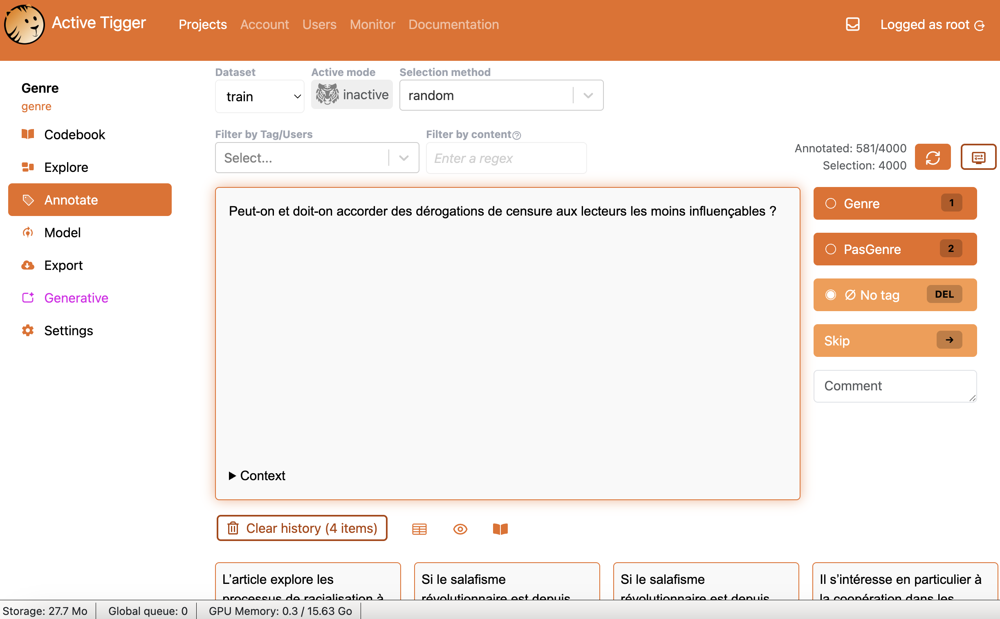
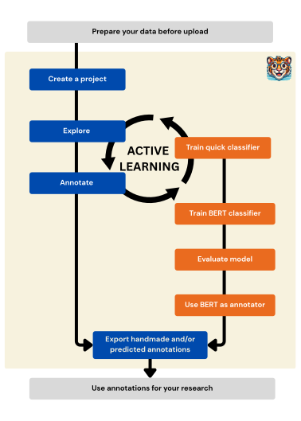

## ActiveTigger = a new tool

- Why a new tool for text annotation ?
- Some elements of its general philosophy !
- ... and a demo rather a long discourse

{fig-align="center"}

## Why a new tool ?

- Initially, a recurring need: **put labels on large text corpora**
  - Traing classifiers usually needs specific programming skills...
- Small LLM (BERT) can be useful once fine-tuned, especially to scale
  - And with embeddings possibility to train classic ML
- Need for reproducible and **on-premises** solutions
    - Sensitive data, GDPR $\Rightarrow$, reproducibility

## Introducing ActiveTigger

*An open source tool to collaboratively annotate text corpora and train classifiers with active learning to speed up annotation.*

Built since ~2020 from research practice (J. Boelaert & É. Ollion) $\rightarrow$ public **v1.0.0 released in May 2026**

- **Document-level** annotation of large corpora of short texts
- **Sensible defaults first**, customization later -- avoid overwhelming non-experts
- **End-to-end integration** in a single platform
  - Some thoughts on the UX

## What are the main use cases ?

- **Annotate quickly a large corpus** -- fine-tune models from the interface, use **active learning** to accelerate
- **Collaboratively stabilize a codebook** -- multiple users + inter-annotator agreement
- **Identify and retrieve documents of interest** -- BERTopic, regex filters, projections
- **Teach NLP** -- hands-on experience of a full supervised pipeline, no code required

## A growing community

- Dozens of research projects since 2023; published studies: 
  - gender in French social sciences (Boelaert et al. 2025), MPs on Twitter (Claesson 2025)
- Available dev instance @CREST (with ~ 150 users)

Launch your own instance (docker & helm chart on its way)

- Code: `github.com/activetigger/activetigger`
- Docs: `activetigger.com/documentation` · Discord community

## Let's have a demo: gender in French social sciences

*How prominent is gender-related research in French social science publications?* (Boelaert et al. 2025, ARSS)

{fig-align="center" height="75%"}

## Connect

[https://demo.activetigger.com](https://demo.activetigger.com)

**account : jadt{0-50} (same password)**

{fig-align="center"}

# More information

## Main features (1): annotate & represent

- **Projects**: CSV / Parquet / XLSX import, stratified train/validation/test split, shared across users
- **Annotation**: multiclass & multilabel schemes, integrated codebook, history, filters (label, user, regex, prediction), comments
- **Text representations**: sentence-transformers embeddings, fastText, DFM, regex features
- **Exploration**: tabular view, 2D projections (UMAP / t-SNE), BERTopic topic models

## Main features (2): train, evaluate, predict

- **Selection strategies**: random, sequential, and active learning (max entropy, target-label probability...)
- **Two families of classifiers**:
    - *Quick models*: scikit-learn classifiers on features, cross-validated, trained in seconds
    - *BERT models*: Hugging Face fine-tuning, key hyperparameters exposed, loss curves
- **Evaluation**: precision / recall / F1 per class, macro F1, confusion matrices, misclassified examples -- computed separately on train / validation / test
- **Inference & export**: predict on the full dataset or external files; export annotations, features, models, predictions
- *(Experimental)* generative panel: prompt external LLM APIs, compare with human annotations

## Does it hold up? Validation

**Reproducibility** -- fine-tuning benchmark on a published stance-detection dataset (Luo et al. 2021, global warming, 3 labels):

- Original BERT-base baseline: accuracy 71% [0.64--0.77]
- ActiveTigger, same parameters: accuracy 0.69--0.72, within the reported confidence interval
- The dataset ships with ActiveTigger so anyone can reproduce

**Robustness** -- stress tests on a fresh cloud GPU server (13 min install):

- 10 simultaneous projects with BERT trainings: queue handled correctly, delay < 0.8s
- 10 users annotating the same project: all operations OK, delay < 0.4s

## Limitations & roadmap

**Current limitations for an instance**

- Single-GPU deployments, a few dozen users
- Exports don't yet capture full project state

**Roadmap**

- Task management refactoring $\rightarrow$ multi-GPU, larger communities
- Stable evaluation framework (reference datasets, versioned benchmarks)
- Generative panel co-designed with the social science community
- Full project archiving for re-executable annotation campaigns

## Takeaways

- ActiveTigger = **end-to-end, collaborative, open source** annotation platform for social sciences
- Encodes supervised-learning best practices in the interface
- Active learning as the bridge between **human annotation and automation**
- Validated, in production, and driven by a research community

\vspace{1em}

**Try it**: request an account or deploy your own instance - [emilien.schultz@ensae.fr](emilien.schultz@ensae.fr)
